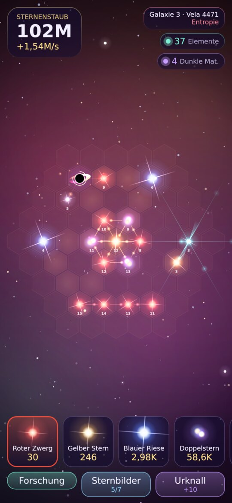
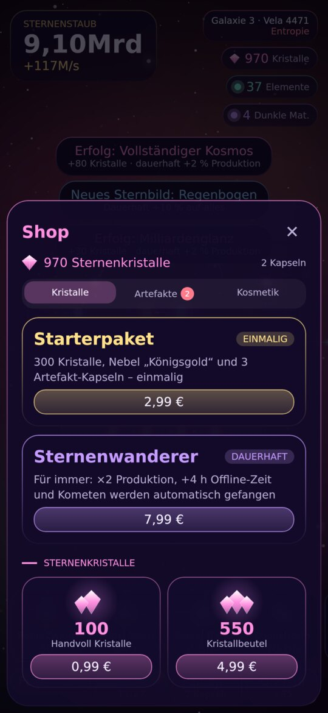
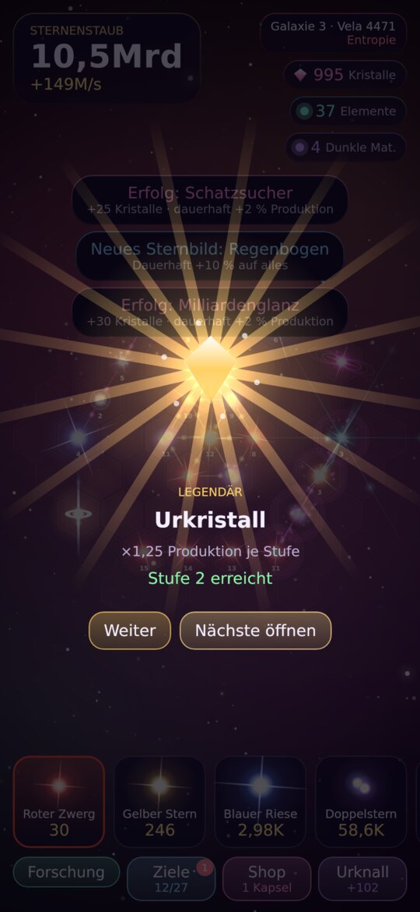
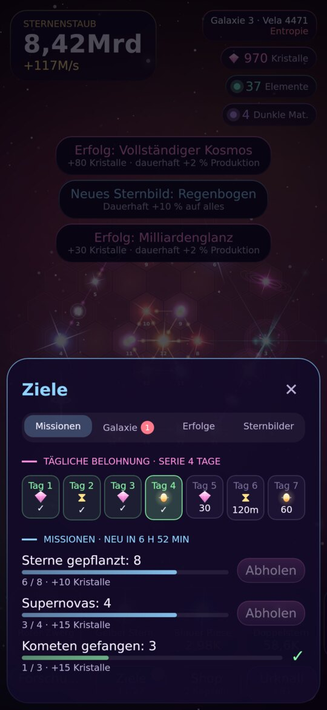
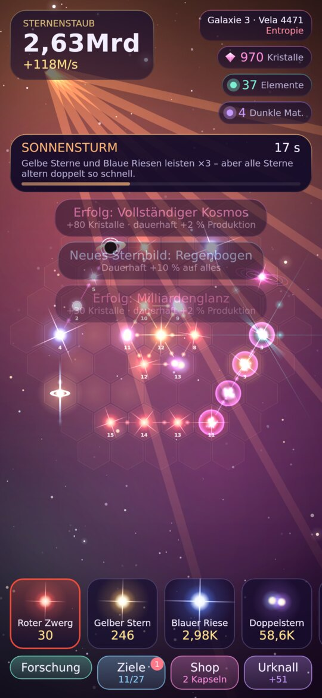
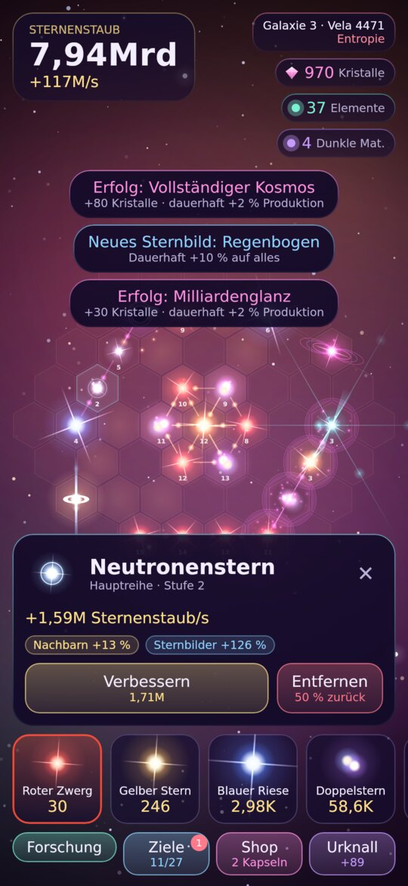
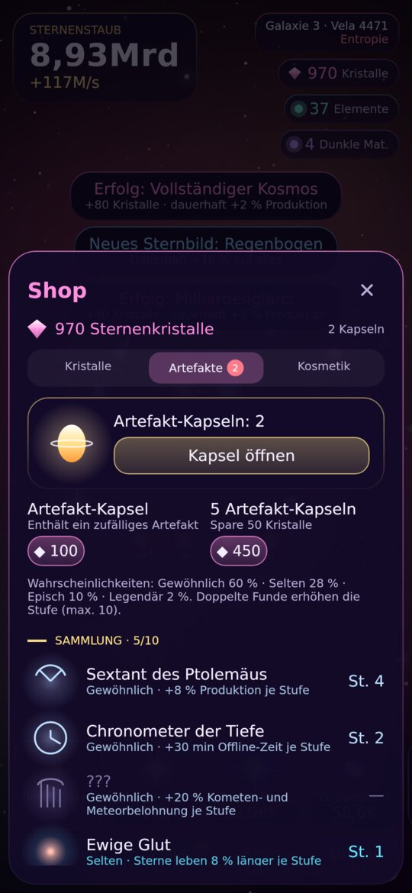
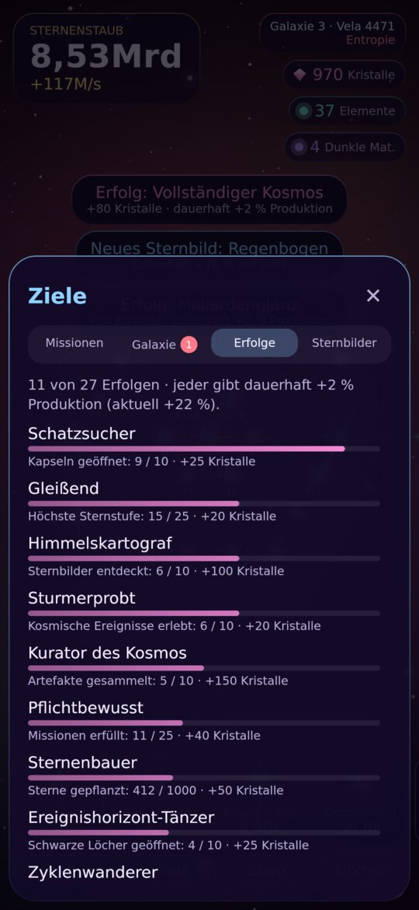

# Sternengarten 🌌

Ein Idle Game für **Android und iOS**, gebaut mit **Kotlin Multiplatform + Compose Multiplatform**.
Du pflanzt Sterne in einen lebendigen Nebel. Wie viel dein Garten produziert, hängt davon ab, **wo** du sie hinsetzt, nicht nur davon, wie viel du kaufst.

<p>
  
  
  
  
</p>
<p>
  
  
  
  
</p>

## Spielidee

| Mechanik | Was sie besonders macht |
|---|---|
| **Räumliches Idle-Spiel** | Vierzehn Sternarten (vier davon nur in ihrer eigenen Galaxie) stehen auf einem Hex-Raster und beeinflussen sich gegenseitig, siehe Tabelle unten. |
| **Sternen-Lebenszyklus** | Sterne werden geboren, altern und vergehen. Blaue Riesen explodieren als Supernova, bringen Elemente und düngen die Felder ringsum. Das Säen und Ernten wird so zur Strategie. |
| **Sternbilder** | Zehn Formen wie Linien, Dreiecke, Kronen, Himmelsleiter oder Quasar-Thron. Aktive Sternbilder stärken ihre Mitglieder, und jedes entdeckte gibt dauerhaft +10 %. |
| **Kosmische Ereignisse** | Alle paar Minuten passiert etwas: *Sonnensturm*, *Gravitationswelle*, *Dunkle Flut*, *Sternenregen* oder ein *Meteorschauer*, dessen Meteore man antippen kann. Jedes Ereignis bringt eigene Effekte und ändert kurz die Regeln. |
| **Fünf Galaxien gleichzeitig** | Spirale, Frost, Glut, Polarlicht und Schatten wachsen parallel. Jede sammelt ihren eigenen Staub, hat eigene Preise und kollabiert einzeln zu Dunkler Materie – spätere Galaxien sind teurer, ihr Urknall bringt dafür bis zu ×20. Neue Galaxien kosten Dunkle Materie und entstehen in Echtzeit (1 h bis 24 h). |
| **Felder freikaufen** | Der Garten wächst Feld für Feld: Jedes angrenzende Feld lässt sich einzeln kaufen, jedes weitere kostet mehr. Wo du wächst, entscheidet über Sternbilder, Pulsar-Achsen und Schattensterne. |
| **Sternenbrücken** | Verbinde zwei Galaxien: Ein Teil der Produktion der einen fließt als Staub in die andere – hilfreich beim Aufbau, zählt aber nicht für den Urknall. |
| **Urknall mit neuen Naturgesetzen** | Das Prestige bringt Dunkle Materie. Jede neue Galaxie hat ein eigenes Naturgesetz, etwa *Zeitdehnung*, *Entropie* oder *Himmelsharfe*, und **drei Galaxie-Ziele**. Wer alle drei erfüllt, bekommt eine Bonus-Kapsel. |
| **Missionen & Erfolge** | Jeden Tag gibt es drei Missionen und einen Login-Kalender mit sieben Tagen. Dazu kommen 36 Erfolge, die jeweils Kristalle und dauerhaft +2 % Produktion bringen. |
| **Artefakte** | Zehn sammelbare Artefakte in vier Seltenheiten, jedes mit dauerhaftem Bonus. Doppelte Funde erhöhen die Stufe bis 10. Die Fundchancen werden im Shop offen angezeigt. |
| **Kosmetik** | Nebel-Themen wie Polarlicht, Glutnebel oder Königsgold sowie Funken-Stile wie Goldregen oder Regenbogen. |
| **Kometen & Offline-Fortschritt** | Kometen fliegen ab und zu vorbei und lassen sich antippen. Die Zeit, in der du weg warst, wird vollständig simuliert, einschließlich Supernovas – die aktive Galaxie fein, die übrigen etwas gröber. |

### Sternarten

| Stern | Regel |
|---|---|
| Roter Zwerg | Günstig und ewig. |
| Gelber Stern | +25 % für jeden Nachbarn, wird später zum Weißen Zwerg. |
| Blauer Riese | Sehr stark, aber −15 % je belegtem Nachbarfeld. Endet als Supernova. |
| Doppelstern | ×2, wenn ein zweiter Doppelstern daneben steht. |
| Pulsar | +40 % entlang seiner drei Achsen, bis 3 Felder weit. |
| **Neutronenstern** | Jeder Nachbar leistet, als wäre er 5 Stufen höher. |
| Schwarzes Loch | Saugt die Hälfte der Produktion seiner Nachbarn auf. Antippen gibt das Dreifache frei. |
| **Magnetar** | +60 % für Sterne in genau zwei Feldern Abstand. |
| **Nebelwiege** | Produziert selbst nichts. Ihre Nachbarn altern nicht mehr und bekommen +20 %. |
| **Quasar** | +3 % für alle Sterne je Stern im Garten. |
| ★ Eiskristall (Frost) | +30 % je 60°-Drehlage um das Zentrum, auf der ebenfalls ein Stern steht. |
| ★ Glutstern (Glut) | +35 % je weiterem Glutstern im zusammenhängenden Nest; explodiert nach 300 s, größere Nester bringen mehr Elemente. |
| ★ Polarlichtstern (Polarlicht) | +35 % je verschiedener Sternart unter den Nachbarn. |
| ★ Schattenstern (Schatten) | +60 % je angrenzendem Feld, das nicht zum Garten gehört. |

## Ingame-Käufe

Die Premium-Währung heißt **Sternenkristalle**. Man verdient sie auch im Spiel, über Missionen, Erfolge, Galaxie-Ziele und den Login-Bonus. Ausgeben kann man sie für Artefakt-Kapseln, Zeitsprünge, Kometenrausch, Kosmetik und um Galaxien und Sternenbrücken sofort fertigzustellen.

Echtgeld-Produkte (alle vom Typ **In-App-Produkt**, keine Abos):

| Produkt-ID | Inhalt | Typ | Richtpreis |
|---|---|---|---|
| `de.vcxrisi.sternengarten.crystals_100` | 100 Kristalle | verbrauchbar | 0,99 € |
| `de.vcxrisi.sternengarten.crystals_550` | 550 Kristalle | verbrauchbar | 4,99 € |
| `de.vcxrisi.sternengarten.crystals_1200` | 1.200 Kristalle | verbrauchbar | 9,99 € |
| `de.vcxrisi.sternengarten.crystals_3500` | 3.500 Kristalle | verbrauchbar | 24,99 € |
| `de.vcxrisi.sternengarten.starter_pack` | 300 Kristalle, Nebel „Königsgold“, 3 Kapseln | einmalig (nicht verbrauchbar) | 2,99 € |
| `de.vcxrisi.sternengarten.wanderer_pass` | ×2 Produktion, +4 h Offline, Kometen automatisch fangen | dauerhaft (nicht verbrauchbar) | 7,99 € |
| `de.vcxrisi.sternengarten.galaxy_pioneer` | 6 zusätzliche Startfelder in jeder Galaxie, halbe Erschließungs- und Brückenzeit, 250 Kristalle, 2 Kapseln | dauerhaft (nicht verbrauchbar) | 4,99 € |

Die angezeigten Preise kommen live aus dem Store. Die Richtpreise erscheinen nur als Platzhalter, solange der Store noch lädt.

### Technik

- **Gemeinsame Schnittstelle:** `composeApp/src/commonMain/.../store/StoreGateway.kt`.
- **Android:** `PlayStoreGateway` mit **Google Play Billing Library 8**.
  - Kristalle werden verbraucht, Starterpaket und Sternenwanderer werden bestätigt.
- **iOS:** `iosApp/iosApp/AppStoreGateway.swift` mit **StoreKit 2**.
  - Nur verifizierte Transaktionen werden gutgeschrieben, inklusive `Transaction.updates`, `Transaction.unfinished` und Wiederherstellung.
- **Desktop:** ein Test-Store, bei dem jeder Kauf sofort und kostenlos gelingt.
- **Gutschrift** in `ShopSystem.grantPurchase`:
  - Jede Transaktion wird genau einmal gutgeschrieben, die IDs werden im Spielstand gemerkt.
  - Erst danach schließt das Spiel die Transaktion beim Store ab. So geht nach einem Absturz kein Kauf verloren.
- **„Käufe wiederherstellen“** stellt dauerhafte Käufe wieder her, zahlt aber keine Kristalle erneut aus.

> **Hinweis:** Die Käufe werden auf dem Gerät gutgeschrieben. Für ein Spiel mit großer Reichweite empfiehlt sich zusätzlich eine Server-Prüfung der Kaufbelege, über die Google Play Developer API bzw. die App Store Server API.

### Einrichtung in den Stores

**Google Play Console**
1. App mit der Paket-ID `de.vcxrisi.sternengarten` anlegen und einen signierten Build in einen Test-Track hochladen, zum Beispiel „Interner Test“.
2. Unter *Monetarisieren → Produkte → In-App-Produkte* alle sieben Produkt-IDs aus der Tabelle anlegen und aktivieren.
3. Unter *Einstellungen → Lizenztests* deine Test-Konten eintragen. Käufe mit diesen Konten werden nicht abgerechnet.
4. Die App aus dem Test-Track installieren. Käufe funktionieren nur mit einer über Play installierten App.

**App Store Connect**
1. App mit der Bundle-ID `de.vcxrisi.sternengarten` anlegen (Name in App Store Connect: „Sternengarten: Idle“).
2. Unter *In-App-Käufe* die vier Kristall-Pakete als **Verbrauchsartikel** anlegen, Starterpaket, Sternenwanderer und Galaxie-Pionier als **Nicht-Verbrauchsartikel**.
3. Lokal testen: In Xcode über *File → New → File → StoreKit Configuration File* (mit „Sync with App Store Connect“) eine Testkonfiguration erzeugen und im Scheme unter *Run → Options → StoreKit Configuration* auswählen. Alternativ in TestFlight mit Sandbox-Konten testen.

## iOS-Build mit Codemagic (TestFlight)

`codemagic.yaml` enthält den Workflow **iOS TestFlight**. Er baut die App in der Cloud auf einem Mac, signiert sie und lädt sie zu App Store Connect hoch. Danach steht der Build internen Testern in TestFlight zur Verfügung. Ein eigener Mac ist dafür nicht nötig.

- **Signieren:** Die App wird mit `app-store-connect fetch-signing-files --create` signiert. Distribution-Zertifikat und App-Store-Profil legt Codemagic beim ersten Build selbst an.
- **Was in Codemagic hinterlegt sein muss:**
  - ein App-Store-Connect-API-Schlüssel mit dem Namen **`Codemagic`** (großes C)
  - die Variablen-Gruppe **`code-signing`** mit dem Secret `CERTIFICATE_PRIVATE_KEY`
- **Build-Nummer:** Die Codemagic-Variable `$BUILD_NUMBER` wird als `CURRENT_PROJECT_VERSION` eingetragen. Die Version (`MARKETING_VERSION`) steht in `iosApp/Configuration/Config.xcconfig`.
- **Komplette Klick-Anleitung** für Apple Developer, App Store Connect und Codemagic: [`docs/TESTFLIGHT.md`](docs/TESTFLIGHT.md). Sie ist auch als Auftrag für eine Claude-Sitzung mit Chrome-Erweiterung geschrieben.

## Projekt öffnen und starten

**Voraussetzungen:**
- Android Studio (aktuelle Version) mit dem Plugin **Kotlin Multiplatform**.
- JDK 17 oder neuer.
- Für iOS zusätzlich ein Mac mit Xcode.

1. Den Projektordner in Android Studio öffnen und den Gradle-Sync abwarten.
2. **Android:** die Run-Konfiguration `composeApp` auswählen, dann Emulator oder Gerät wählen und ▶ drücken.
   Alternativ im Terminal: `./gradlew :composeApp:assembleDebug`
3. **iOS** (nur auf dem Mac):
   - Entweder die iOS-Run-Konfiguration des KMP-Plugins in Android Studio verwenden.
   - Oder `iosApp/iosApp.xcodeproj` in Xcode öffnen und starten. Die Build-Phase ruft automatisch `./gradlew :composeApp:embedAndSignAppleFrameworkForXcode` auf.
   - Für ein echtes Gerät deine Team-ID in `iosApp/Configuration/Config.xcconfig` eintragen. Die Bundle-ID ändert sich dadurch nicht.
4. **Desktop** mit Test-Store: `./gradlew :composeApp:run`
5. **Tests der Spiellogik:** `./gradlew :composeApp:desktopTest`

## Aufbau

```
composeApp/src/
  commonMain/kotlin/de/vcxrisi/sternengarten/
    game/model/    Datenmodell: Hex-Raster, Sternarten, Naturgesetze, Upgrades, Sternbilder,
                   Fortschritt (Missionen, Erfolge, Ereignisse, Ziele), Sammlung (Artefakte, Kosmetik), Store-Katalog
    game/engine/   Reine Spiellogik:
                     GameEngine        Zeit, Aktionen, Ereignisse, Urknall (eine Galaxie)
                     GalaxyOrchestrator Hintergrund-Galaxien, Erschließen, Sternenbrücken
                     GalaxyFactory     Neubeginn einer Galaxie, Startfelder
                     BoardAnalyzer     Produktion, Sternbilder
                     ProgressionSystem Missionen, Erfolge, Login, Galaxie-Ziele
                     ShopSystem        Kristall-Angebote, Kapseln, Kosmetik, Kaufgutschrift
                     Balance           alle Spielwerte
    game/save/     Speichern als JSON (multiplatform-settings), Format und Migration alter Spielstände
    store/         StoreGateway-Schnittstelle, Test-Store
    ui/            GameController (Spielschleife, Autosave, Offline-Zeit, Store), Theme, HUD, Panels, Dialoge
    ui/render/     Nebel, Sterne, Raster, Kamera, Ereignis-Effekte
    ui/fx/         Partikelsystem
  commonTest/      Tests der Spiellogik (Engine, Inhalte, Shop, Käufe)
  androidMain/     MainActivity, PlayStoreGateway, Manifest, adaptives App-Icon
  iosMain/         MainViewController für SwiftUI
  desktopMain/     Desktop-Fenster mit Test-Store
iosApp/            Xcode-Projekt (SwiftUI-Hülle, AppStoreGateway mit StoreKit 2, geteiltes Scheme, Privacy-Manifest)
codemagic.yaml     CI-Workflow für TestFlight
docs/TESTFLIGHT.md Einrichtung von Apple Developer, App Store Connect und Codemagic
```

Die Spiellogik ist unabhängig von der Oberfläche. Der Spielstand ist unveränderlich, und die Engine arbeitet mit reinen Funktionen. Die Simulation läuft in festen Schritten von 0,1 s. Die Animationen laufen mit der vollen Bildrate.
Alle Spielwerte stehen gesammelt in `game/engine/Balance.kt`.
