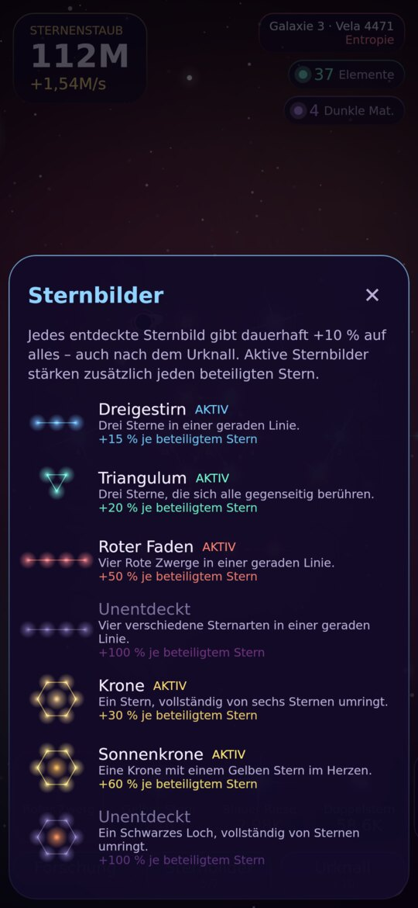
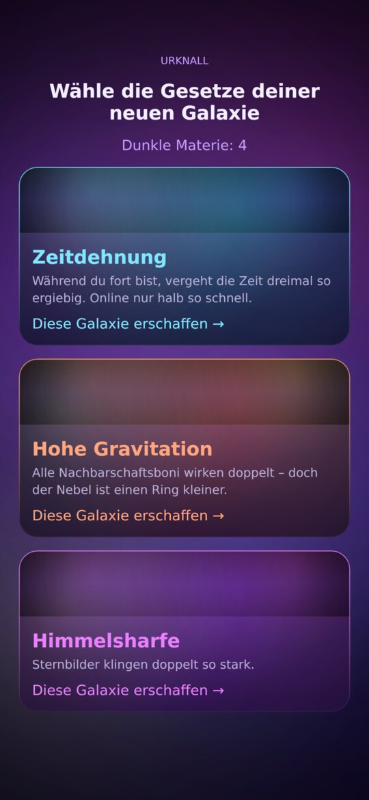

# Sternengarten 🌌

Ein Idle Game für **Android und iOS**, gebaut mit **Kotlin Multiplatform + Compose Multiplatform**.
Du pflanzt Sterne in einen lebendigen Nebel. Wie viel dein Garten produziert, hängt davon ab, **wo** du sie hinsetzt, nicht nur davon, wie viel du kaufst.

<p>
  
  
  
  
</p>

## Spielidee

| Mechanik | Was sie besonders macht |
|---|---|
| **Räumliches Idle-Spiel** | Sterne stehen auf einem Hex-Raster und beeinflussen ihre Nachbarn. Der Gelbe Stern wärmt seine Nachbarn. Der Blaue Riese braucht Platz. Doppelsterne wollen paarweise stehen. Pulsare strahlen entlang ihrer Achsen. Schwarze Löcher saugen Produktion auf und geben sie auf Antippen dreifach zurück. |
| **Sternen-Lebenszyklus** | Sterne werden geboren, altern und vergehen. Blaue Riesen explodieren als **Supernova**, bringen **Elemente** und düngen die Felder ringsum dauerhaft. Gelbe Sterne und Doppelsterne werden zu Weißen Zwergen. Der Garten ist ständig in Bewegung, und das Säen und Ernten wird zur Strategie. |
| **Sternbilder** | Bestimmte Formen bilden Sternbilder, zum Beispiel Linien, Dreiecke, Kronen oder ein Regenbogen aus vier Sternarten. Sie werden mit leuchtenden Linien verbunden und stärken ihre Mitglieder. Jedes entdeckte Sternbild gibt außerdem dauerhaft +10 %. |
| **Urknall mit neuen Naturgesetzen** | Das Prestige bringt **Dunkle Materie**. Danach wählst du eine von drei neuen Galaxien mit einem eigenen Naturgesetz, etwa *Hohe Gravitation*, *Zeitdehnung*, *Entropie* oder *Himmelsharfe*. Dadurch spielt sich jeder Durchlauf anders. |
| **Kometen** | Ab und zu fliegt ein Komet über den Bildschirm. Wer ihn antippt, bekommt Sternenregen oder einen Kometenrausch mit ×5 Produktion. |
| **Offline-Fortschritt** | Während du weg bist, wird die Zeit vollständig simuliert, einschließlich Supernovas. Danach zeigt ein Dialog, was passiert ist. |

## Grafik

Alles wird prozedural mit Compose Canvas gezeichnet, es gibt keine Bild-Assets:
- Treibende Nebelschwaden und ein Sternenfeld mit drei Parallax-Ebenen.
- Sterne mit Leuchthof, Korona und Beugungsspikes, gezeichnet mit additivem Blending.
- Eigene Darstellungen für bestimmte Sternarten: kreisende Doppelsterne, rotierende Pulsar-Strahlen und Schwarze Löcher mit Akkretionsscheibe.
- Ein Partikelsystem für Supernova-Schockwellen, Staubströme und den Kometenschweif.
- Bildschirmwackeln und Haptik als Rückmeldung.
- Pinch-Zoom und Verschieben auf dem Spielfeld.

## Projekt öffnen und starten

**Voraussetzungen:**
- Android Studio (aktuelle Version) mit dem Plugin **Kotlin Multiplatform**.
- JDK 17 oder neuer.
- Für iOS zusätzlich ein Mac mit Xcode.

1. Den Projektordner in Android Studio öffnen und den Gradle-Sync abwarten.
2. **Android:** die Run-Konfiguration `composeApp` auswählen, dann Emulator oder Gerät wählen und ▶ drücken.
   Alternativ im Terminal: `./gradlew :composeApp:assembleDebug`
3. **iOS** (nur auf dem Mac):
   - Entweder die iOS-Run-Konfiguration des KMP-Plugins in Android Studio verwenden.
   - Oder `iosApp/iosApp.xcodeproj` in Xcode öffnen und starten. Die Build-Phase ruft automatisch `./gradlew :composeApp:embedAndSignAppleFrameworkForXcode` auf.
   - Für ein echtes Gerät trägst du deine Team-ID in `iosApp/Configuration/Config.xcconfig` ein.
4. **Desktop** (zum schnellen Ausprobieren): `./gradlew :composeApp:run`
5. **Tests der Spiellogik:** `./gradlew :composeApp:desktopTest`

## Aufbau

```
composeApp/src/
  commonMain/kotlin/de/vcxrisi/sternengarten/
    game/model/    Datenmodell: Hex-Raster, Sternarten, Naturgesetze, Upgrades, Sternbilder, Spielstand
    game/engine/   Reine Spiellogik: GameEngine (Zeit, Aktionen, Urknall), BoardAnalyzer (Produktion, Sternbilder), Balance
    game/save/     Speichern als JSON (multiplatform-settings)
    ui/            GameController (Spielschleife, Autosave, Offline-Zeit), Theme, HUD, Panels
    ui/render/     Nebel, Sterne, Raster, Kamera
    ui/fx/         Partikelsystem
  commonTest/      Tests der Spiellogik
  androidMain/     MainActivity, Manifest, adaptives App-Icon
  iosMain/         MainViewController für SwiftUI
  desktopMain/     Desktop-Fenster
iosApp/            Xcode-Projekt (SwiftUI-Hülle)
```

Die Spiellogik ist unabhängig von der Oberfläche. Der Spielstand ist unveränderlich, und `GameEngine` arbeitet mit reinen Funktionen. Die Simulation läuft in festen Schritten von 0,1 s. Die Animationen laufen mit der vollen Bildrate.
Alle Balance-Werte stehen gesammelt in `game/engine/Balance.kt`.
